# Глубокие генеративные модели

Репозиторий с домашними заданиями курса __Глубокие генеративные модели__ в ITMO AI Talent Hub

Автор: __Азаматов Ильдар Русланович (@eelduck)__

Домашние задания находятся в отдельных ветках:
- homework_1
- homework_2
- ...

# ДЗ 4 Дообучение SD

В качестве персонажа я выбрал Джессику Альбу и собрал 17 фотографий

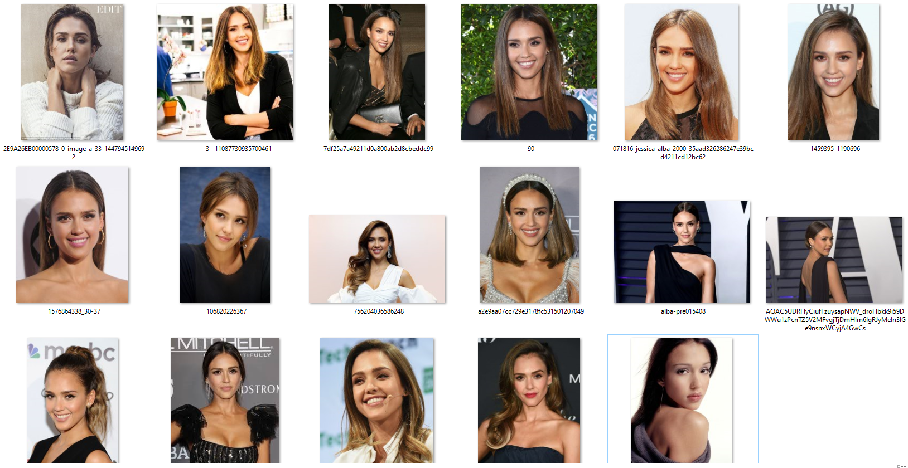

Ноутбуки дообучения находятся здесь:
- [notebooks/dreambooth_training.ipynb](notebooks/dreambooth_training.ipynb)
- [notebooks/dreambooth_lora_training.ipynb](notebooks/dreambooth_lora_training.ipynb)

ControlNet: [notebooks/controlnet.ipynb](notebooks/controlnet.ipynb)


## Дообучение всех весов модели методом dreambooth

Параметры обучения:
```bash
--instance_prompt="a photo of sks woman face" \
--class_prompt="a photo of woman" \
--with_prior_preservation --prior_loss_weight=1.0 \
--resolution=512 \
--train_batch_size=1 \
--learning_rate=2e-6 \
--lr_scheduler="constant" \
--lr_warmup_steps=0 \
--gradient_accumulation_steps=1 \
--num_class_images=500 \
--max_train_steps=800 \
--checkpointing_steps=800 \
--use_8bit_adam \
--mixed_precision="no"\
--train_text_encoder
```

Для теста были взяты следующие промпты:
```python
token = "sks"
promt_list = [
    {
     "name": "office",
     "prompt":f"close up portrait of {token} woman, in the office, sitting, 4K, raw, hrd, hd, high quality, realism, sharp focus",
     "n_prompt":"naked, nsfw, deformed, distorted, disfigured, poorly drawn, bad anatomy, extra limb, missing limb, floating limbs, mutated hands disconnected limbs, mutation, ugly, blurry, amputation",
    },
    {
     "name": "forest",
     "prompt":f"portrait of {token} woman face, in the forest, with inventory, standing, 4K, raw, hrd, hd, high quality, realism, sharp focus",
     "n_prompt":"naked, nsfw, deformed, distorted, disfigured, poorly drawn, bad anatomy, extra limb, missing limb, floating limbs, mutated hands disconnected limbs, mutation, ugly, blurry, amputation",
    },
    {
     "name": "street",
     "prompt":f"portrait of smiling {token} woman, on the street, lights, midnight, NY, standing, 4K, raw, hrd, hd, high quality, realism, sharp focus,  beautiful eyes, detailed eyes",
     "n_prompt":"naked, nsfw, deformed, distorted, disfigured, poorly drawn, bad anatomy, extra limb, missing limb, floating limbs, mutated hands, mutation, ugly, blurry",
    },
    {
     "name": "beach",
     "prompt":f"portrait of {token} woman, on the beach, 4K, raw, hrd, hd, high quality, realism, sharp focus,  beautiful eyes, detailed eyes",
     "n_prompt":"naked, nsfw, deformed, distorted, disfigured, poorly drawn, bad anatomy, extra limb, missing limb, floating limbs, mutated hands, mutation, ugly, blurry",
    },
    {
     "name": "red_carpet",
     "prompt":f"portrait of smiling {token} woman, on the red carpet, lights, oscar, standing, 4K, raw, hrd, hd, high quality, realism, sharp focus,  beautiful eyes, detailed eyes",
     "n_prompt":"naked, nsfw, deformed, distorted, disfigured, poorly drawn, bad anatomy, extra limb, missing limb, floating limbs, mutated hands, mutation, ugly, blurry",
    },
]
```

Параметры инференса:
```python
seed = 147525234
repeat = 2
num_samples = 2
guidance_scale = 7.5
num_inference_steps = 35
height = 768
width = 1024
```

### Результаты тестирования дообученной модели

Street | Red Carpet
------ | ----------
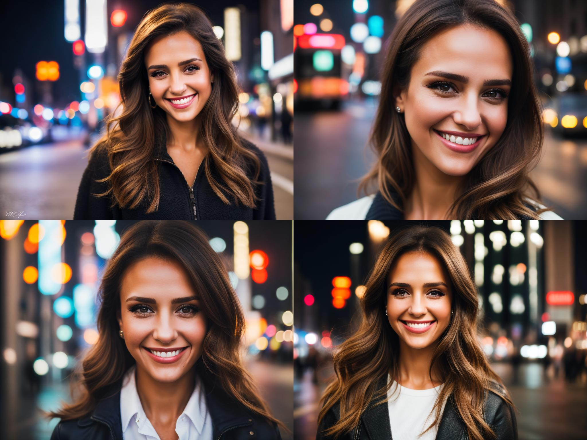 | 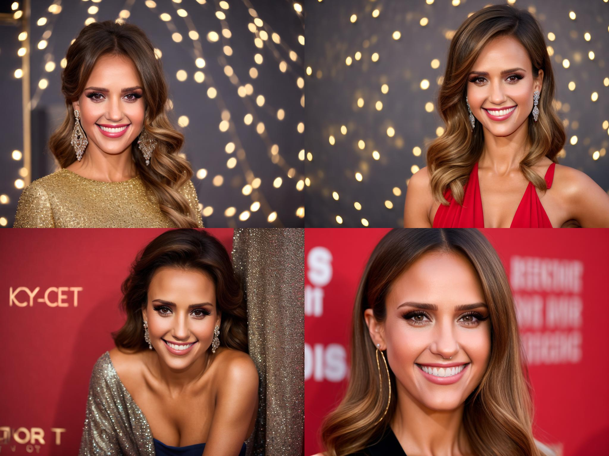 

Office | Forest | Beach
------ | ------ | ------
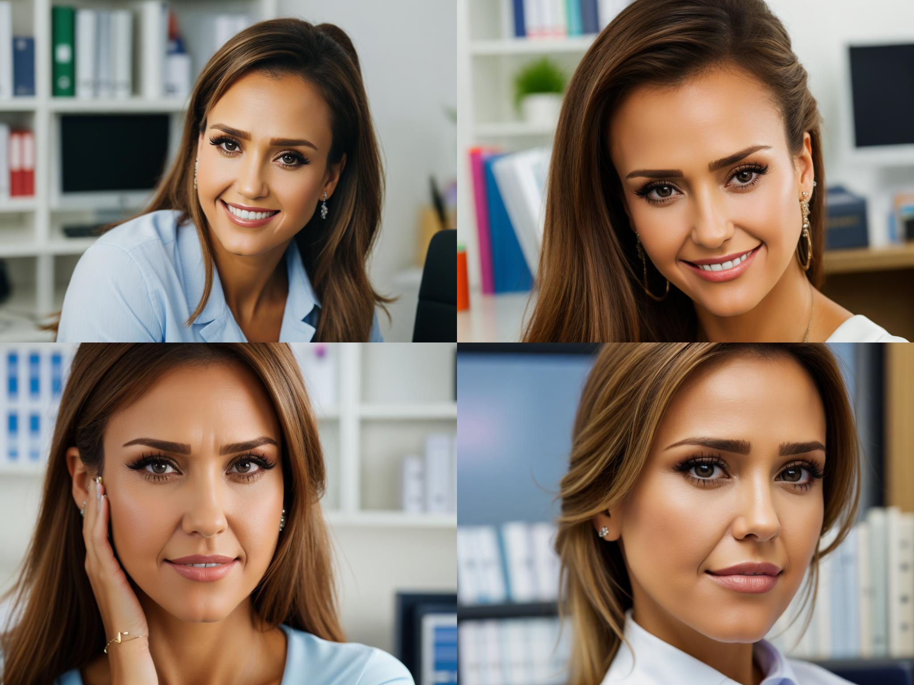 | 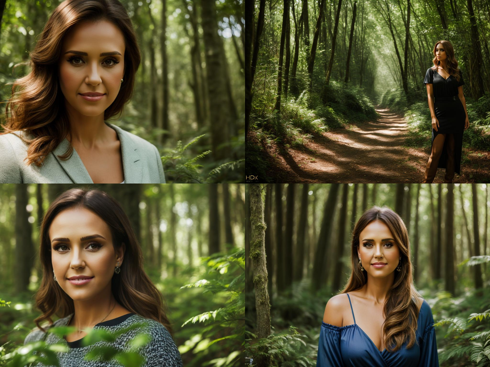 | 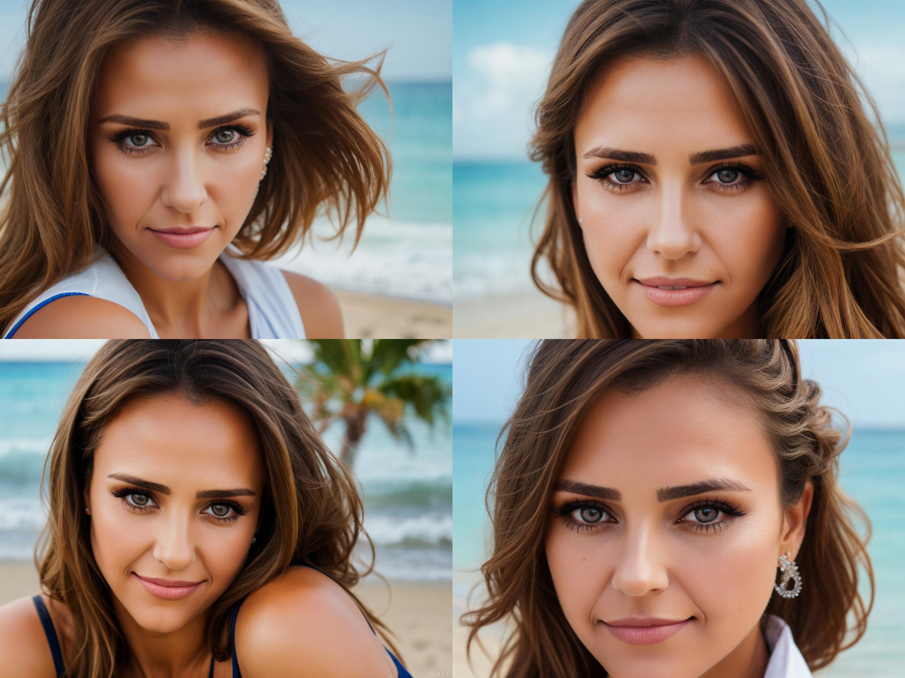

Персонаж получился довольно похожим на оригинал, особенно явно выражены черты, если добавить в промпт smiling и red carpet - оно и не удивительно, Джессика Альба в основном улыбается на фотографиях, а красная дорожка - её естественная среда обитания :)

## Дообучение LoRA адаптера модели методом dreambooth

Параметры обучения:
```bash
--instance_prompt="a photo of sks woman face" \
--class_prompt="a photo of woman" \
--with_prior_preservation --prior_loss_weight=1.0 \
--resolution=512 \
--train_batch_size=4 \
--learning_rate=2e-4 \
--lr_scheduler="constant" \
--lr_warmup_steps=0 \
--gradient_accumulation_steps=1 \
--num_class_images=500 \
--max_train_steps=800 \
--checkpointing_steps=800 \
--use_8bit_adam \
--mixed_precision="no"\
--train_text_encoder \
--rank=32 # варьируется 2, 8, 16, 32
```

Промпты для тестирования и параметры инференса остались такие же, как и с полного дообучения

### Результаты тестирования дообученной модели

Представлю таблицу сравнения результатов работы по промпту с красной дорожки для различных рангов матрицы

R=2 | R=8
------ | ------ 
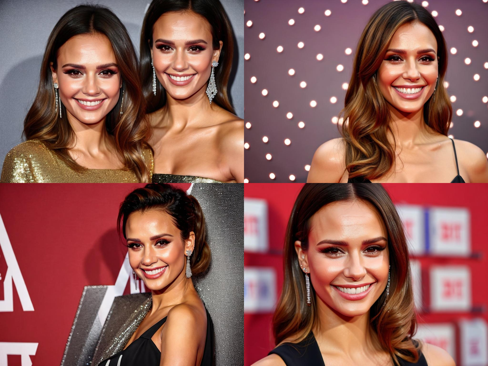 | 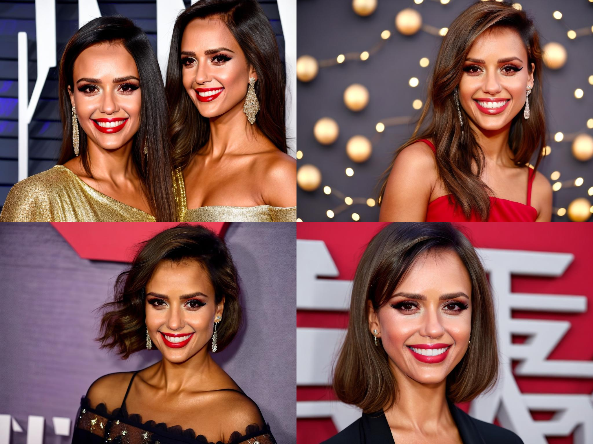

R=16 | R=32
------ | ------ 
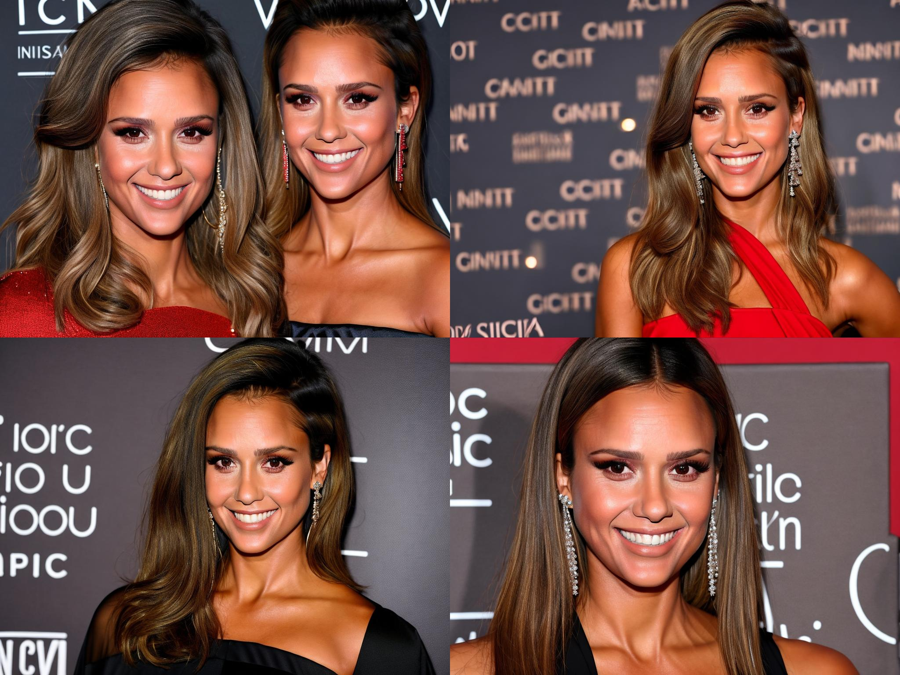 | 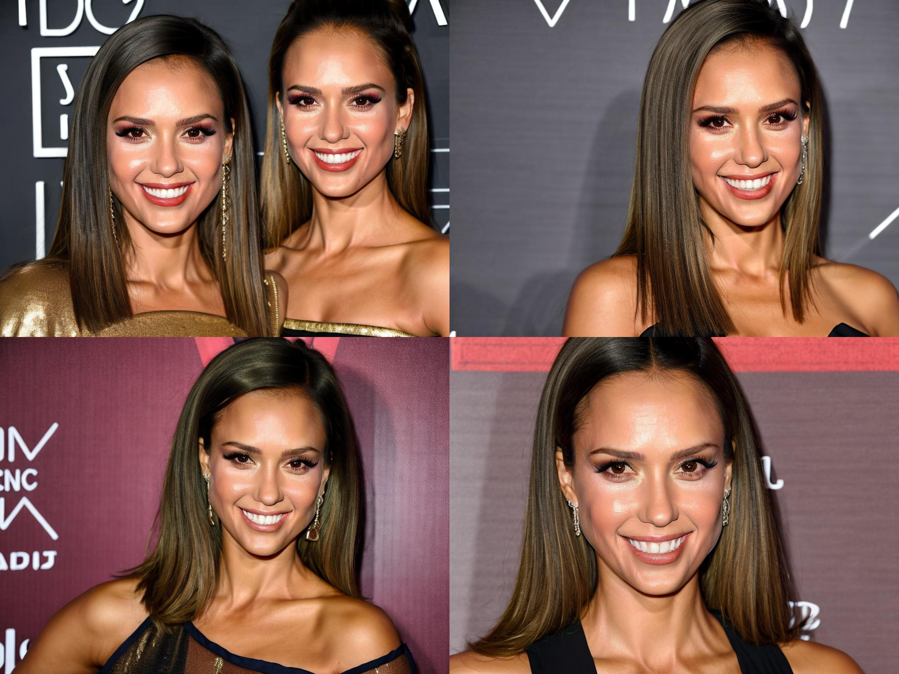

Полностью репорты по всем промптам можно посмотреть в папке [jessica_alba](jessica_alba/)

Субъективно, кажется, что R=16 получился лучше всего, поэтому выведу для R=16 результаты всех промптов

Street | Red Carpet
------ | ----------
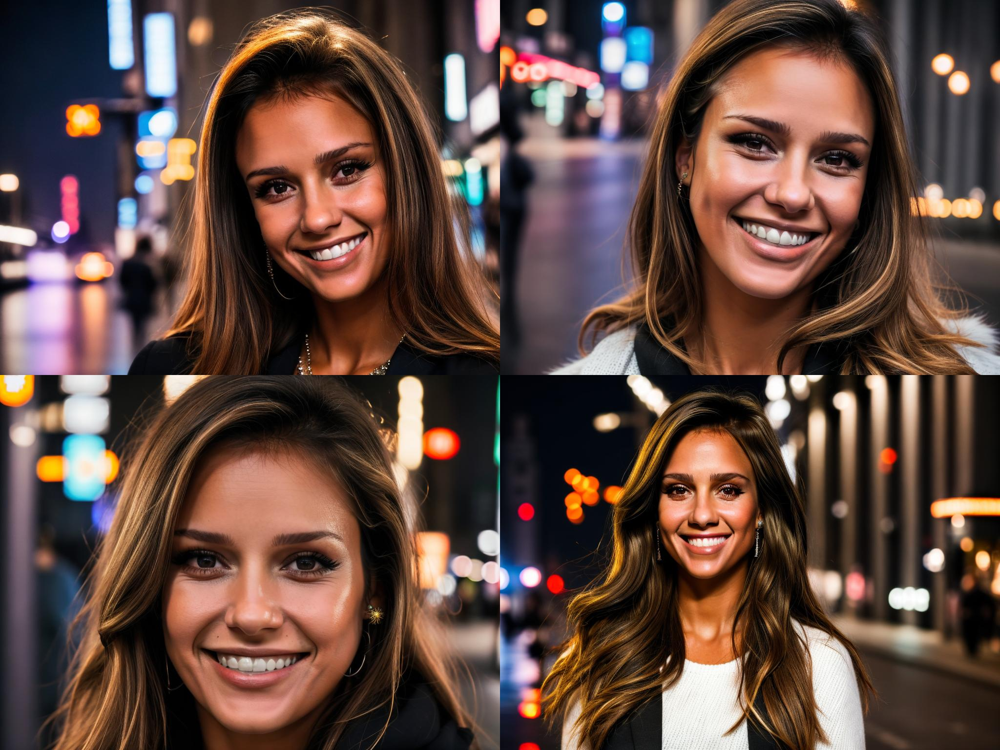 |  

Office | Forest | Beach
------ | ------ | ------
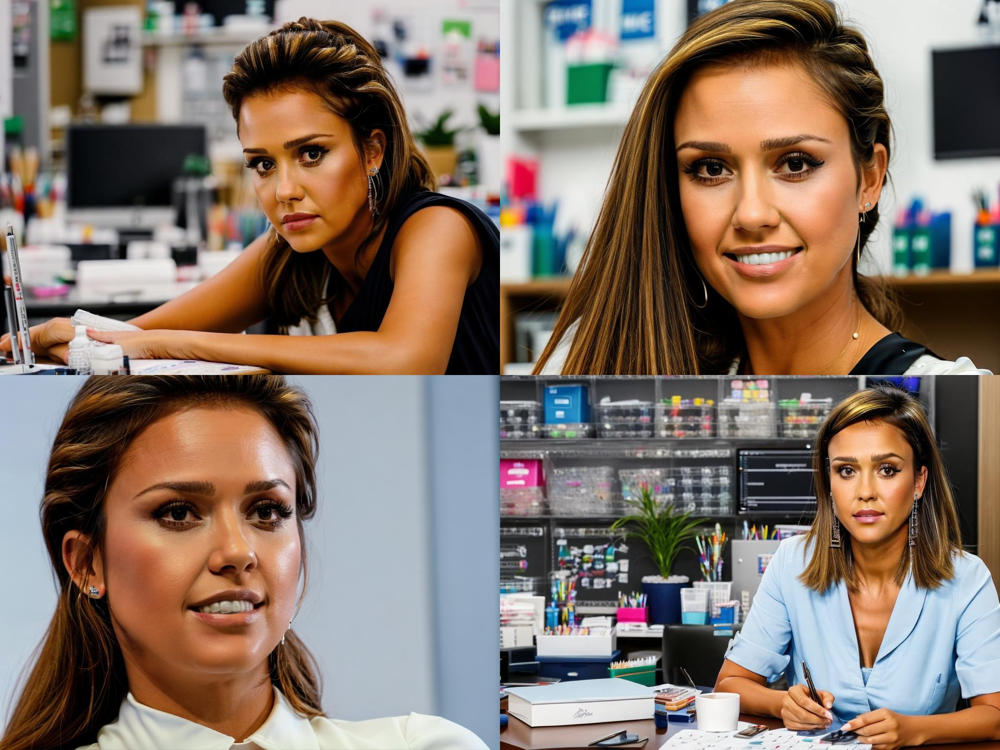 | 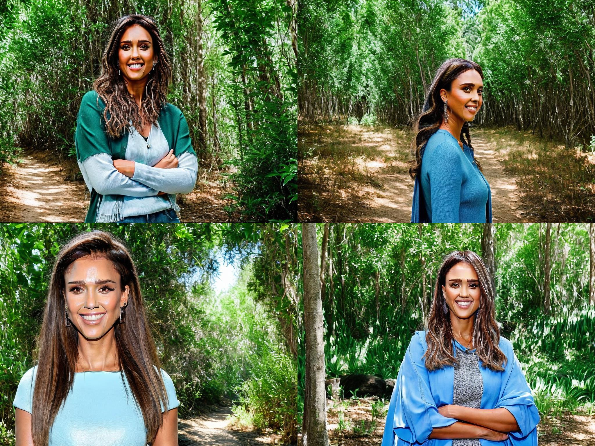 | 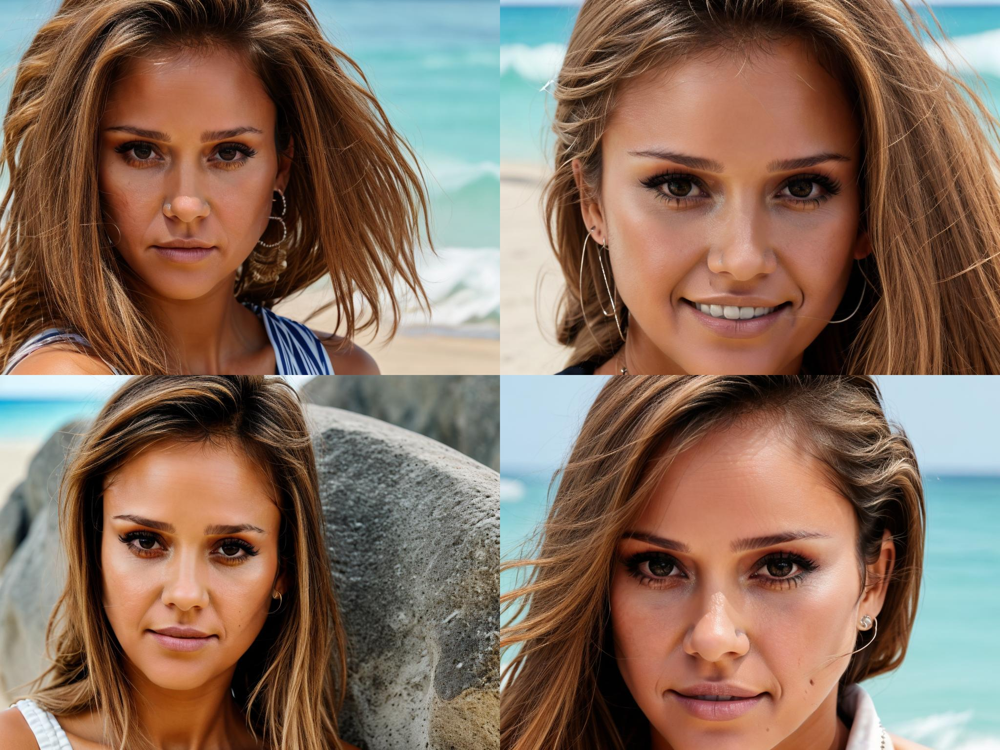

В целом тоже получилось неплохо, но всё же __хуже, чем полноценное дообучение__

## ControlNet

В качестве базовой модели взял дообученную полностью модель, т.к. она показала наилучшие результаты

### Canny Model

Для Canny модели использовал картину __Девушка с жемчужной сережкой__

Промпт: 
```python
{
     "name": "gir_with_pearl_earring",
     "prompt": "close up portrait of smiling sks woman, red carpet, 4K, raw, hrd, hd, high quality, realism, sharp focus",
     "n_prompt": "monochrome, lowres, bad anatomy, worst quality, low quality, naked, nsfw, deformed, distorted, disfigured, poorly drawn, bad anatomy, extra limb, missing limb, floating limbs, mutated hands disconnected limbs, mutation, ugly, blurry, amputation"
}
```

Параметры генерации:
```python
seed = 147525234
num_samples = 1
guidance_scale = 6
num_inference_steps = 35
controlnet_conditioning_scale = 0.55
```

Оригинал | Canny | Промпт
-------- | ----- | ------
 |  | 

Не так похоже на Джессику Альбу, как при обычной генерации, но какие-то черты улыбки и глаз присутствуют


