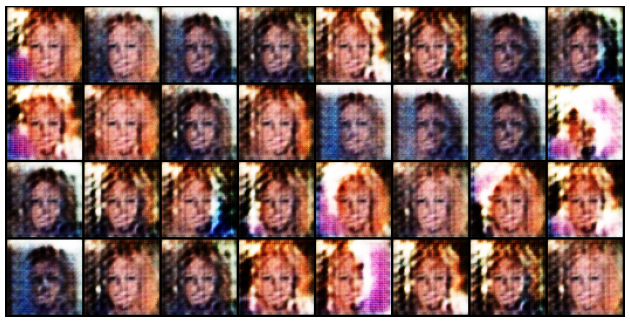
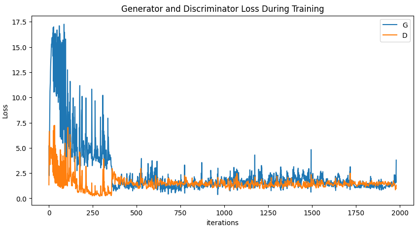

# Глубокие генеративные модели

Репозиторий с домашними заданиями курса __Глубокие генеративные модели__ в ITMO AI Talent Hub

Автор: __Азаматов Ильдар Русланович (@eelduck)__

Домашние задания находятся в отдельных ветках:
- homework_1
- homework_2
- ...

# ДЗ 1

## Часть 1. Байесовская генерация

Решение находится в ноутбуке [notebooks/1_bayesian_generation.ipynb](notebooks/1_bayesian_generation.ipynb)

### Генерация стилей

Для генерации стилей был написан класс StylesGenerator. На вход подаются словарь стилей и словарь с числом встречаний каждого из элементов стиля.

Генерация реализована методом Maximum Likelihood Estimation (MLE) с аддитивным сглаживанием

На выходе получаем следующую генерацию в виде стиля и его вероятности:

```python
(('длинные прямые',
  'серебристо серый',
  'круглые очки',
  'комбинезон',
  'черный'),
0.0024742420643526697)
 ```

 ```python
(('короткая курчавые',
  'серебристо серый',
  'солнцезащитные очки',
  'футболка с круглым вырезом',
  'красный'),
 0.0010870811815920191)
 ```

### Генерация аватаров

Для генерации аватаров был написан класс AvatarGenerator. На вход подаётся путь до автаров в "обучающей" выборке, чтобы по ним посчитать статистику пикселей.

Генерация - MLE с аддитивным сглаживанием

На выходе получаем следующую генерацию аватаров:

Аватар 1            | Аватар 2           | Аватар 3
:------------------:|:------------------:|:------------------:
 |  | 


Все 3 аватара похожи, но они на самом деле отличаются

## Часть 2. Автоэнкодеры

Задача определять пролив металла в трубках

Датасет находится в папке [dataset/](dataset/):
- proliv - фото с проливом для подбора трешхолда по MSE
- test - тестовый датасет
- train - датасет для обучения

Код для решения этой задачи оформлен в классы и функции:
- [src/dataset.py](src/dataset.py) - торчовый датасет
- [src/linear_autoencoder_model.py](src/linear_autoencoder_model.py) - модель автоэнкодера с линейными слоями
- [src/convolution_autoencoder_model.py](src/convolution_autoencoder_model.py) - модель автоэнкодера на свертках
- [src/utils.py](src/utils.py) - вспомогательные функции для визуализации, оценки, подбора трешхолда

Ноутбуки с обучением и оценкой моделей:
- [2_linear_autoencoder.ipynb](notebooks/2_linear_autoencoder.ipynb)
- [2_convolution_autoencoder.ipynb](notebooks/2_convolution_autoencoder.ipynb) - автоэнкодер на свертках

### Метрики

| Модель | TPR | TNR | Best MSE threshold
|--------|-----|-----|-------------------
|Linear Autoencoder|0.79|0.86| 0.0029
|Convolutional Autoencoder|0.84|0.78| 0.00066
