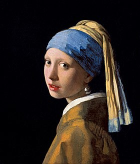
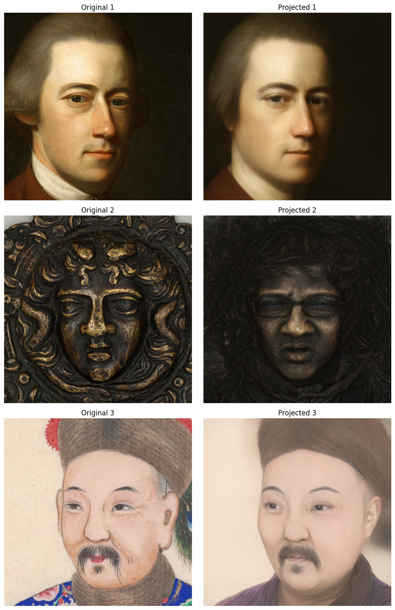

# Глубокие генеративные модели

Репозиторий с домашними заданиями курса __Глубокие генеративные модели__ в ITMO AI Talent Hub

Автор: __Азаматов Ильдар Русланович (@eelduck)__

Домашние задания находятся в отдельных ветках:
- homework_1
- homework_2
- ...

# ДЗ 2 Имплементация GAN

На входе имеем изображения известных личностей

Задача имплементировать DCGAN с блоками CSPup вместо обычных свёрток

## Решение

### DCGAN CSPup 128x128
Бейзлайн архитектура находится в ноутбуке [notebooks/dcgan-csp-baseline.ipynb](notebooks/dcgan-csp-baseline.ipynb)
Улучшенное решение находится в ноутбуке [notebooks/dcgan-csp.ipynb](notebooks/dcgan-csp.ipynb)

Бейзлайн архитектура соответствует требуемой в задании, помимо этого добавлены:
- BatchNorm для всех блоков GAN
- Активации для всех блоков
- Для увеличения размерности feature maps использовались слои ConvTranspose 

На размерности 128x128 были проведены эксперименты:
- LR для дискриминатора был кратно меньше генератора
- Дискриминатор обучался не каждую итерация, а через одну
- Добавлен weight decay в Adam оптимизатор для дискриминатора
- Менял активации для генератора и CSPup

Пока что ни один эксперимент не привел к сходимости, либо дискриминатор переигрывал генератор (лосс дискриминатора 0, генератора - 100), либо наоборот

### DCGAN CSPup 64x64
Какой-либо сходимости для DCGAN с CSPup блоками удалось добиться на изображении 64x64

#### Лосс

#### Генерация

Но по картинкам видно, что произошел mode collapse - все картинки похожи друг на друга. В планах попробовать следующие эксперименты:

- Wesserstein Loss
- Unrolled GAN
- Label Smoothing
- Попробовать добавлять/убирать слои в G и D
